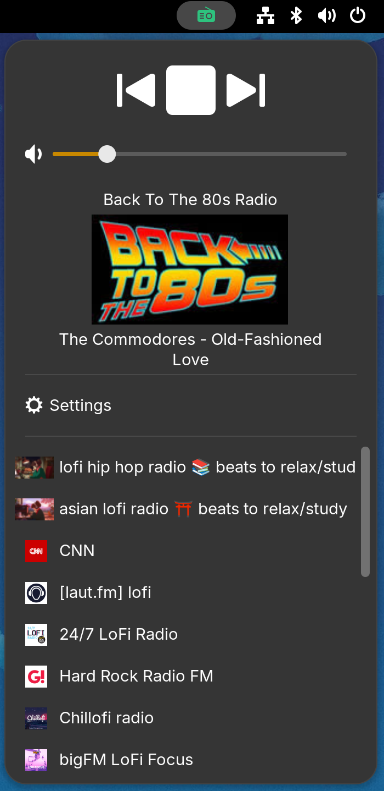
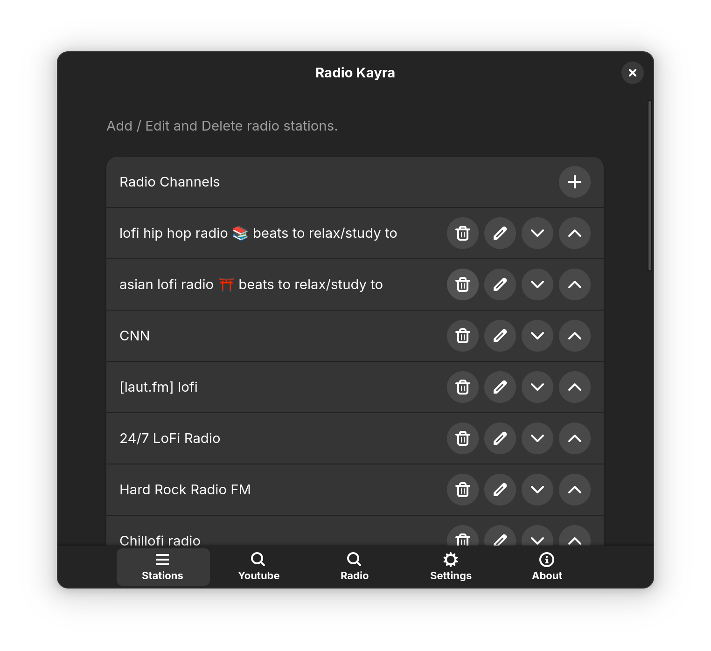
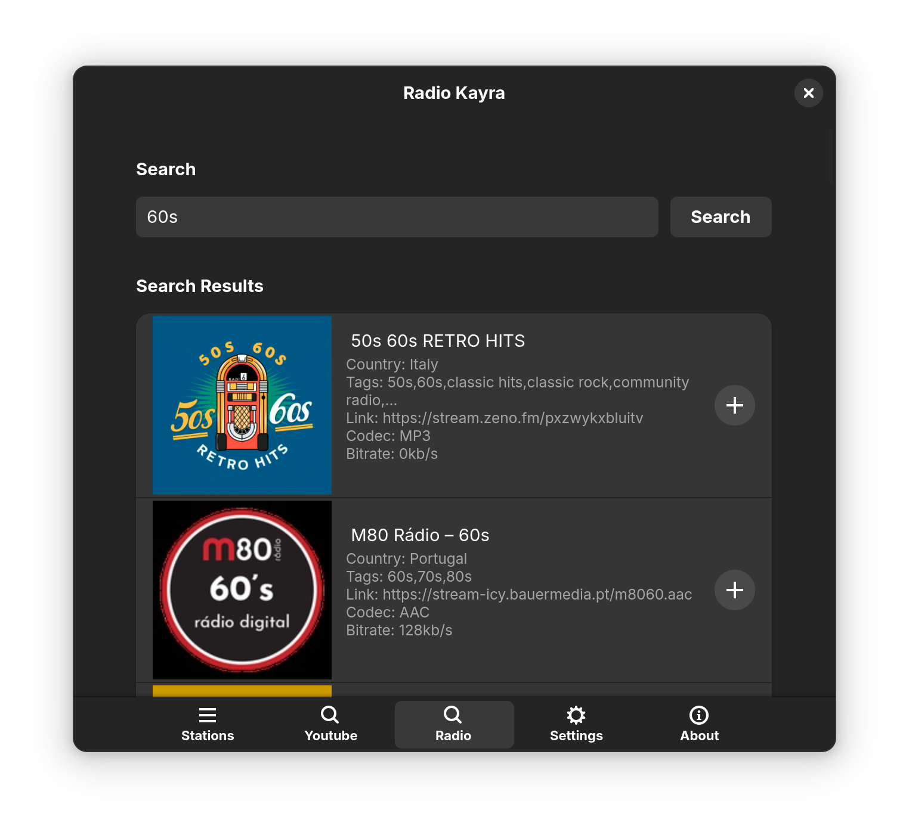

# Radio Kayra

Radio Kayra is a free and open source [Gnome](https://www.gnome.org/) desktop extension that plays your favorite music and podcast streams in the background. 

It utilizes [yt-dlp](https://github.com/yt-dlp/yt-dlp) and [GStreamer](https://gstreamer.freedesktop.org/) for url/thumbnail resolving and audio playback respectively.



## Requirements
1. [Gnome 46,47 or 48](https://gnome.org/) 
2. [GStreamer](https://gstreamer.freedesktop.org/download/#linux) 
3. [YTDLP](https://github.com/yt-dlp/yt-dlp/wiki/Installation) 

## Features v1.0:
* Gnome tray icon. Play/Stop button. Volume slider.
* Channel list in a scroll view. Plays with one click.
* Auto downloads Radio/Video name and thumbnail. You don't have to manually enter.
* Integrated into Gnome shell search. 
* Left mouse click on the radio icon opens the menu, mid click toggles between play / stop, right click opens channel editor.
* Add/Delete/Edit channels in preferences. You can also move them up and down.
* Saves last played channel and volume level for each session.
* Displays currently playing song in a radio (if provided).
* Has built-in Youtube search, using [yt-dlp](https://github.com/yt-dlp/yt-dlp/). You don't need to use a browser or copy paste urls to find music or podcasts.
* Has built-in Radio search, using [radio-browser.info](https://www.radio-browser.info/).
* Supports all direct audio stream urls including local audio files.
* Supports a wide range of streaming websites that requires url resolving such as youtube, twitter, rumble etc. Here is the list from [yt-dlp page](https://github.com/yt-dlp/yt-dlp/blob/master/supportedsites.md).
* Live channels that are detected by yt-dlp have a live icon below their thumbnail. Otherwise its duration is displayed in hh:mm:ss format.
* Language support. For now only English and Turkish. But no coding necessary to add more languages. See [Gjs guide](https://gjs.guide/extensions/development/translations.html#scanning-for-translatable-strings)

## Features v2.0:
* Back & Forward buttons to navigate through stations.
* Radio & Youtube search returns up to 30 results.
* Settings page. Change scroll area height, right click behaviour.
* Can copy the currently playing artist+song into clipboard with a right click! (Enable from settings)
Now you can right click on the icon and just paste it in the youtube search.
* Displays Artist / Song / Station info tooltip when you hover over the radio icon. (Can be disabled)


## Channel Management

This window opens if you right click on the radio icon or click "Edit Channels" on the main panel. 

Here you can see your current channels. On each row there are 4 buttons. Delete channel, Edit Channel, Move Channel Up and Move Channel Down. Last two allows you to sort your channels.

If you click the + button on top of the list, you can manually add a radio channel.

Here you can paste your own stream url and a name. 
* If the url requires no resolving (a direct url to a stream), then uncheck "Use yt-dlp?". Enter a name and click "Add".
* If the url requires resolving (i.e. Youtube, Rumble, Twitter/X) and is [supported by yt-dlp](https://github.com/yt-dlp/yt-dlp/blob/master/supportedsites.md), then paste the url and leave "Use yt-dlp?" checked. You can enter a name manually or you can click "Fetch from url" to let yt-dlp retrieve the official title (recommended). You can later edit the field.


## Youtube Search
Select "Youtube Search" on the top, type your search phrase and click enter or search button. This will perform a youtube search and the results will be retrieved and displayed asynchronously. It returns up to 30 results. 

 

To add a search result. Just click the + button next to it. This will add the channel name, url and the thumbnail to your stations.

## Radio Search
Select "Radio Search" on the top, type your search phrase and click enter or search button. This will perform a radio search and the results will be retrieved synchronously and then displayed (so it may freeze for 1-2 seconds, unlike youtube search). It returns up to 30 results.

 

To add a search result. Just click the + button next to it. This will add the channel name, url and the thumbnail to your stations.

## Gnome Search
You can click radio icon and click any channel to play. But you can also search through your channels using integrated Gnome shell search feature. Clicking any of the search results starts playing the channel.

 

## Settings

Here you can change the right click and hover behaviour as well as the scroll area height. 

 

## Notes
* If you only use radio channels-direct links, the extension should work without installing yt-dlp but features will be lacking.
* Extension stops all activity on screen lock.
* If a channel thumbnail is not provided by the host url, then a placeholder icon is used (```audio-x-generic-symbolic```).
* Thumbnails and channel list json file are saved in your `/.config/radio-kayra` folder and is kept on updates.
* channels.json file only holds the channels. Each node is in the following format:

```
{
    "id": "3c136fd7-a94c-45be-be3f-4f683b4d5781",
    "name": "Rammstein - Sonne (Official Video)",
    "order": 8,
    "useYtdlp": true,
    "uri": "https://www.youtube.com/watch?v=StZcUAPRRac"
}
```
* Key features are decoupled and are represented in seperate files for ease of modification.    
    1. Icon names used and various size constants are in ```constants.js```
    2. yt-dlp commands are in ```ytdlphandler.js```
    3. Every sub-panel has a seperate class and file ```popXXX.js```
    4. GStreamer related code is only inside ```radiokayra.js```
    5. Search functionalities are in ```searchradio.js```, ```searchyoutube.js``` and gnome search is in ```searchProvider.js```

* I will probably add MPV support as an alternative to GStreamer in the future.
* Code checked with [eslint](https://eslint.org/)  

Contact: ayhanavci@gmail.com

Enjoy,
Ayhan